<h1>TERRARIUM SUPPLIES IRELAND</h1>
<p align="center">
        
    </p>

Welcome to Terrarium Supplies Ireland, 

You can visit the live site [here](https://terrariumsupplies.herokuapp.com/)

You can view the Github Repo [here]( https://github.com/ShonaOB/terrariumsupplies
)
***
##About the Company
<br>
Terrarium Supplies Ireland was set up to provide a “one-stop-shop” solution for customers wishing to build their own terrariums at home. The idea emerged in 2021, following an unsuccessful attempt by one of our founders to buy all his terrarium supplies from one store online. Living in Ireland, it was proving extremely difficult to locate all the items from one store & have them shipped at a reasonable cost. And so TSI was born! As we start off, we supply coco coir or a custom soil mix, terrarium containers, clay pebbles and decorative stone, and a small amount of accessories. We are delighted to be working towards adding plants, succulents and other accessories in the future. 
*** 
<br>

##Index – Table of Contents

* [User Experience R&D](#user-experience-research-and-design)
    * [Strategy](#strategy)
    * [Scope](#Scope)
    * [Structure](#Structure)
    * [Wireframe](#Wireframe)
    * [Surface](#Surface)
* [Web Marketing Strategy](#Web-marketing-strategy)
* [Features](#Features)
* [Data Model](#Data-Model)
* [Testing](#Testing)
* [Deployment](#Deployment)
* [Credit & Attributes](#Credit-&-attributes)

<br>

***
<br>
##User Experience & Research
<br>
### Problem Statement
While gardening centres in Ireland experienced a huge increase in business sales during the Covid pandemic, it remains quite difficult to locate the specific items needed for Terrarium Builds from one store. Buying from several different stores results in delays to the start of your project, expense due to shipping costs for each item rather than one single delivery and potentially customs charges for buying from UK sites. 
<br>
***
###Objectives of the Site
The objectives of the website are to drive sales through a B2C web application, including payment services and communication channels. The customer will have the ability to create a user account to store default information, and to leave reviews of the product as required. The site will allow terrarium enthusiasts to source all their needs from one location. 
<br>
***
###Persona – the Ideal Client
For Design Theory we have developed a Persona for our Ideal Client.
<p>
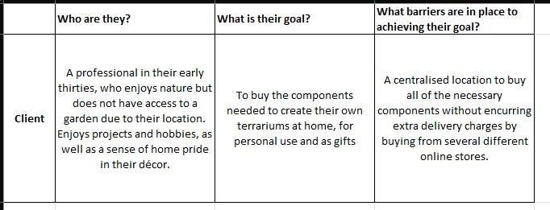
</p>
###Strategy
Following the creation of the User Persona, the User Stories were created and a Kanban Board (using [Github Projects]( https://github.com/users/ShonaOB/projects/5) was made to track these user requirements. A social media presence was also created by way of a Facebook Page which can be found [here]( https://www.facebook.com/Terrarium-Supplies-Ireland-100324116187454) 

###MosCoW Prioritisation
The MosCow approach was used to create the list of in-scope and out-of-scope features. As an agile approach to the project, this has been successful in identifying must-have items and items for future release. 
#Must Have
The web application was deemed to have the following “Must Have” features:
•	Online Catalogue – allowing Superusers to upload products for sale
•	Stock Control – allowing Superusers to assign a stock level, which is automatically adjusted after a sale. 
•	Product Photos – clear images that customers can use to choose the items they want
•	A Shopping Bag facility – which can be added to and adjusted as required
•	Online Payment facility – to complete orders online in a timely and secure fashion
•	Customer Profiles – the ability to create a profile on the site to store repeat delivery information
•	Product Reviews – the ability for customers to post reviews on the site as required
•	Administrative Control – Superusers must have access to control products & other administrative facilities
##Could Have
The following items were listed as “could haves” and taken on as part of this project:
•	Email Facility – to email customers upon completion of orders, and on registering a profile. 
•	Email Subscription – the ability to sign up as a customer for the newsletter, thereby creating a mailing list which can be invaluable for driving sales in the future
•	Login / Logout / Forgot Password Facility for users
##Won’t Have (this time)
The following items were found to be desirable, but were not completed within this round of work:
•	Wishlist/Favourites Facility – the ability for customers to create a wishlist of products. This was started within this project, but found to be pushing the timeline too far and was therefore put on hold until the next round. 
•	A “Build your own Kit” function – to build a terrarium kit containing all of the components required to create a terrarium. This is on hold until such time as plants can be sold online by the owner of the site (licence required)
•	Blog – a weekly blog to be updated with how to, when to and inspirational posts 
•	A “Stallholder” function – to allow other sellers to create “stalls” on the site, where they can upload products and sell for a small monthly subscription.
<br>
###Structure
The site will be built using the following considerations in design. Please note that the final structure may differ as development continues, and following feedback from owners and users. 
•	Simplicity – the site will be clean and clear, with little distracting features to ensure a more pleasing UI experience. 
•	Colours – the colours chosen for this site were developed using Adobe Color. A relevant image was uploaded to the service, and a colour palette created from this using a color wheel:
•	Hierarchical structure – the homepage is the landing page, acting as a jumping-off location for all other links and features. 
•	Nav-Bar: A mobile responsive nav-bar which adjusts depending on the login status of the user. 
<p> 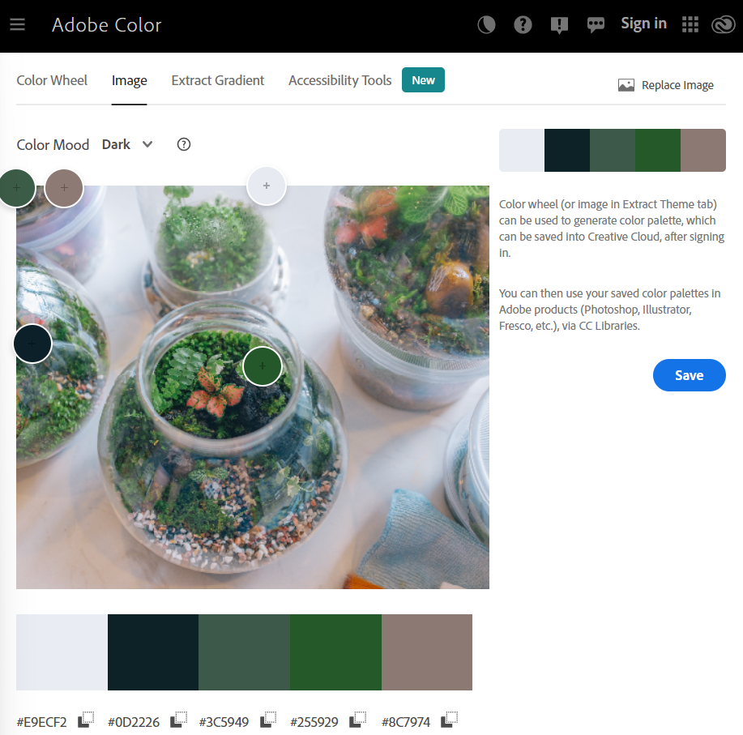</p>
<br>
###Wireframe
In order to visualise how the site should look upon completion, a wireframe was created using Lucid Chart. This was also used to identify the most appealing layout of the aspects of the site, and to stay within common design themes – such as the accounts/shopping bag being positioned in the top right hand corner. 
<p>
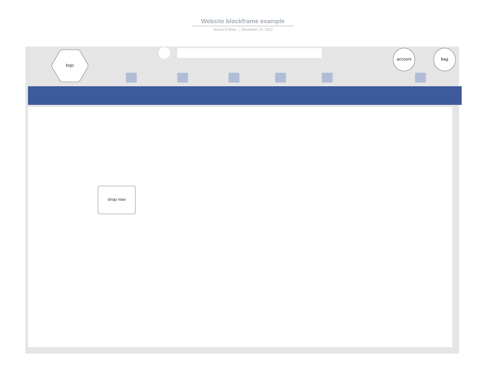
</p>
<br>
###Keyword Research
I performed keyword research to understand the types of topics and categories users would search for when looking for a site like this. I started with a brainstorm of the most obvious keywords – “Terrariums”, “Terrarium gifts”, “houseplants”, “Interior Décor plants”, “nature lover gifts”. From this I used Google Search to develop more keywords and some long tail keywords. 
<p>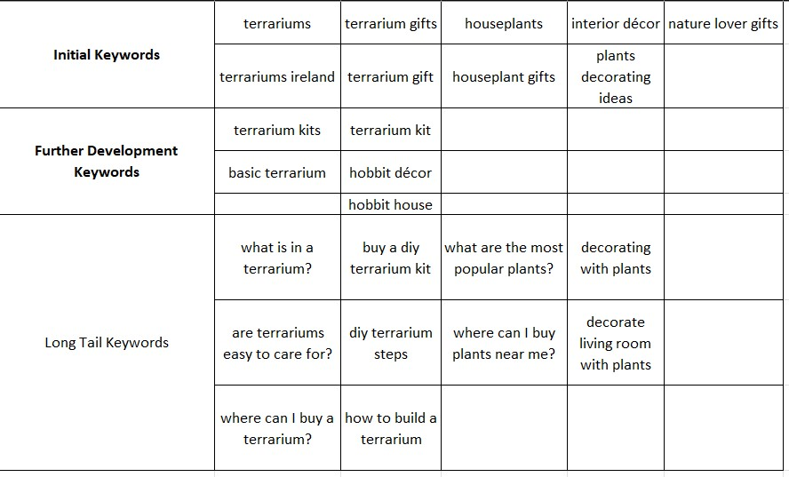</p>
<br>
###Surface
The colour palette for this web application was developed using Adobe Color to find complementary colours based on a Terrarium theme. An image of a terrarium was uploaded to the service provided by Adobe and a palette developed from that. 

The colours in use are: 
•	Off-white - #E9ECF2
•	Dark grey in place of black - #0D2226
•	Dusky Green as a signature colour - #3C5949
•	A pale terracotta for accents - #8C7974
<p></p>

Adobe Color also has an Accessibility Tool which allowed me to confirm that the text and background colours that I chose are considered a good contrast ratio:
<p>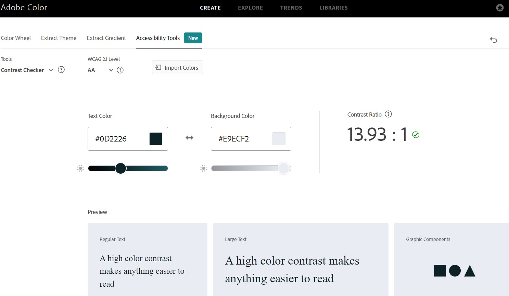
</p>

The font chosen for this web application was Montserrat. The reason for choosing this font was because of it’s ability to create a simple but clean visual experience. It has a high readability as a sans serif typeface, and therefore works well for accessibility. It is also widely available and unlikely to cause errors in loading on browsers. For this site, I wanted clean, clear but sophisticated type, and Montserrat provides just that. 

###Marketing Strategy – web marketing

With no physical store available for driving sales, web marketing is the most important part of running this business – next to a functioning web application! SEO Optimisation will be hugely important for this business. As part of this strategy, I have done some valuable keyword research for this project ([see here](#Keyword Research) for more information. 

An XML Sitemap was created using XML-sitemaps.com which was then uploaded to the root folder of the website, and a Google Search verification meta tag was added to the header. This was then verified by Google:
<p>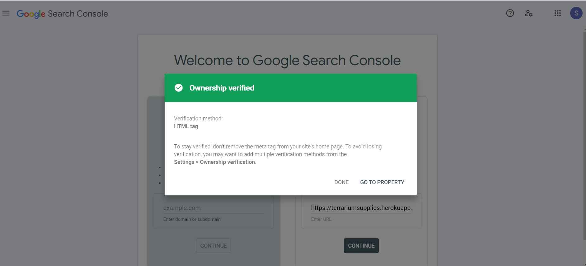</p>

##Mailchimp
An email marketing campaign is going to be hugely important for getting the business up and running and continuing sales throughout the year. To start this process, I have added a Newsletter Sign up form to the website. Once the owner has established a list of email addresses, it will be simple to target these potential customers with useful content to drive sales, such as “how to”, “special features” and offers or sales. 
<p>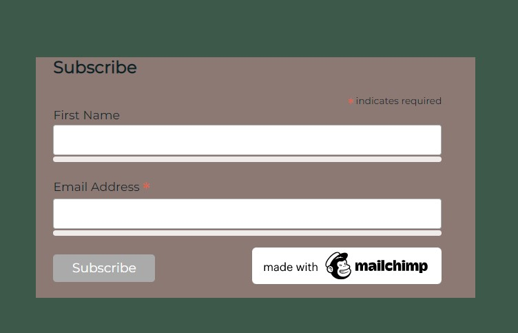</p>

##Social Media
Social Media will be one of the most important aspects of running this business. To begin, I have set up a [Facebook Page]( https://www.facebook.com/Terrarium-Supplies-Ireland-100324116187454) which can be utilised to draw in custom. Additionally, I recommend an Instagram account, because Terrariums are such a visual product, as well as a TikTok, LinkedIn and Twitter account – which can be set up by the owner or developed by me in a later stage. 

A YouTube channel has been set up to run tutorials in the future and to grow the social media following, and therefore drive sales. The YouTube Channel can be found [here]( https://www.youtube.com/channel/UCIBiiFbFoIPEklGvS44TJiA). 

###Site Structure
The site has been constructed to follow conventional website structures – which provide familiarity and a sense of trust in the customers – but also to be fresh, clean and professional. The theme is nature based, in line with the company values. 
##Header
The header was developed using the Code Institute template as provided for Project 5. It was customised to suit this particular business.
<p>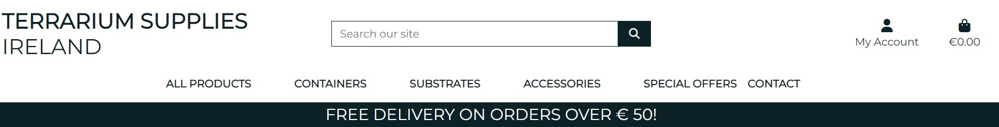</p>
##Homepage
The layout of the homepage was also developed from the Code Institute template, simply because it matched the most appropriate style for this business. It provided a clean, clear slate on which to put various pieces of content, and the template was customised for TSI. 
<p></p>

##Footer
The footer was developed using MDBoostrap – please see [here](https://mdbootstrap.com/docs/standard/navigation/footer/) and was customised to match the colour theme developed with Adobe Color.
<p>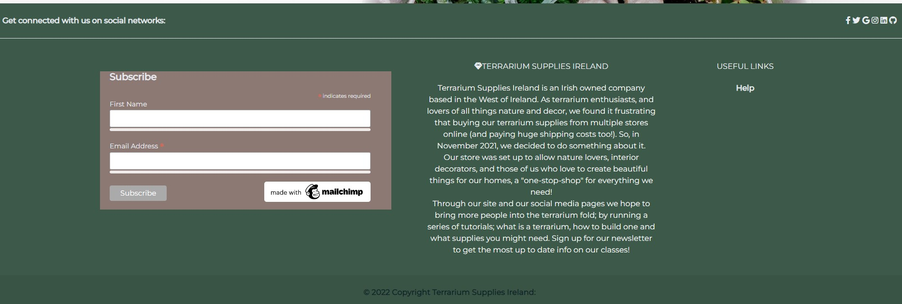</p>

##Products
The products pages are designed to be easily navigated through using sort, filter and search features. 
<p>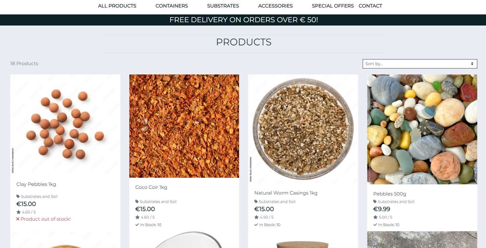</p>

##Product Detail
The Product Detail page follows a similar style to the walkthrough project on Code Institute, but it has been customised to include a Reviews feature. 
<p>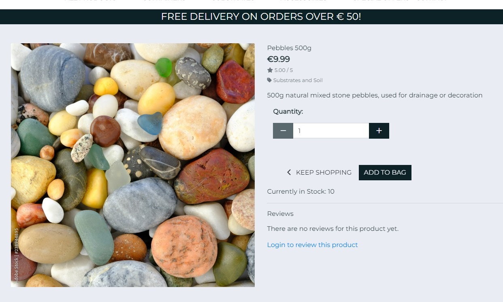</p>

##Shopping bag
The Shopping Bag is designed to promote further shopping. There is a prompt on the page to continue shopping to achieve free shipping, as well as a “Continue Shopping” Button.
<p>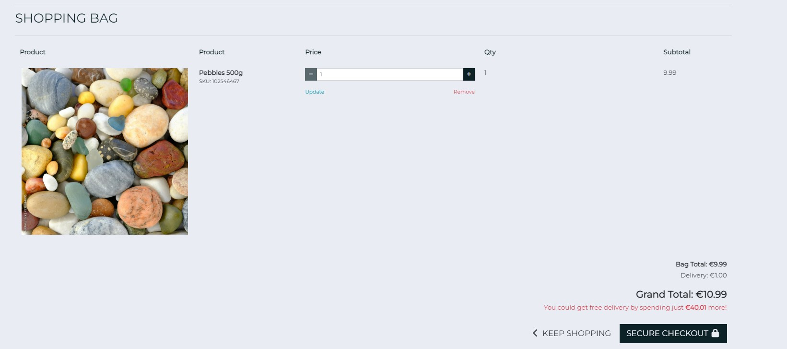</p>

##Checkout
The checkout page utilises the Stripe API to collect card detail, as well as supplying a summary for the customer of their order. Upon completion of the transaction, users are automatically navigated to the checkout success page which provides a confirmation of the items purchased, with the added comfort of the confirmation being emailed to the address provided.
<p>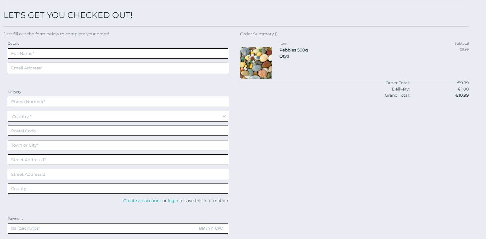</p>


##Profile
Each customer is welcome to create a Profile on the web application, where they can save default shipping information and their reviews. In future projects, we will continue to build the Wishlist App which will go in the User Profile section. This is mentioned in our “MosCoW” section above. It remains as “To Do” in our KANBAN board on Github Projects. 
<p>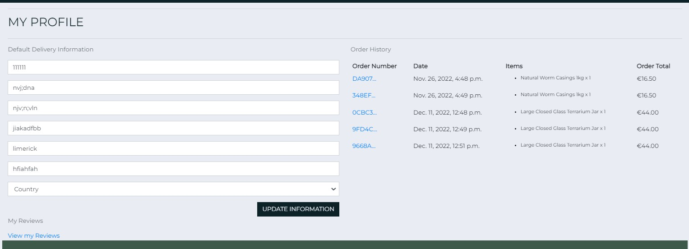</p>

##Admin
The Admin section for Superusers is the Django standard backend, but it is very user friendly. There will be a facility built to allow other “stallholders” to create products here in the future. 

##Reviews
The reviews feature is set up to allow customers to share their thoughts and opinions on the product they have bought. It is hugely important for customer trust to allow customers to post reviews. The reviews are filtered by product on the Product Detail page, and users have the ability to Edit & Delete a review without accessing the admin, but going to their user Profile. 
<p>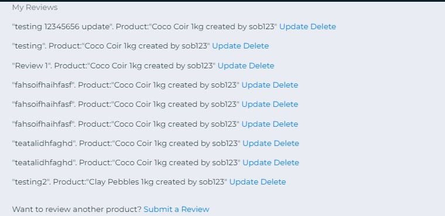</p>

## Contact

Users can contact the business via a form that can be navigated to either directly from the footer, or through the Contact drop down menu within the navbar. A short and simple form can be completed and submitted. These contact requests are available to the SuperUser through the admin. 

##Errors
A Custom 404 page was developed to allow the user to go back to their homepage: 

***

<br>

## Data Model

A database schema was developed to understand the relationships between the data within the site. The initial draft in Excel has been mapped into a data schema below using [LucidChart](https://www.lucidchart.com) to help understand how the entities and data will relate across the site.

The diagram below shows the entity relationships between categories, products, product reviews, users, and an order.
<p>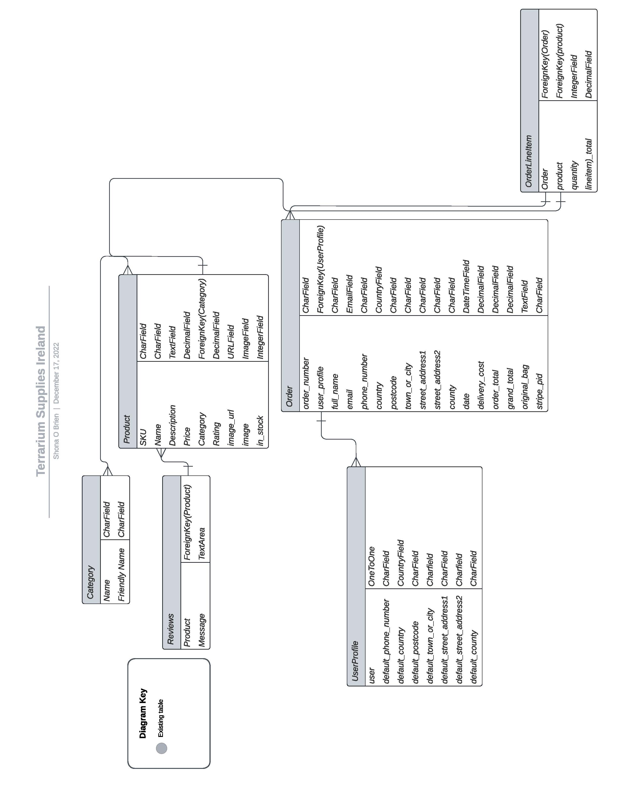</p>

The key component in this relationship is the user. I have used the default Django User Model with customisations for simplicity. Both the user and product models are used by Order and Order Line Item models (as users have an option to checkout as a user or as guest).

With this architecture a user can add many products to one order, and leave many product reviews. 

There are currently five categories created within Category table, and sixteen products. These are used to group the products and can be accessed from the navigation menu. They can managed through the Django admin panel, along with user data, products, reviews and orders. 

<br>

The diagram highlights the following relationships:
* One product can have many reviews
* One product can have one category
* One category can have many products
* One order can have many products
* One user can have one order
* One user can add a review to many products
* One user can add many reviews to one product

<br>

### Data Security

Specific steps have been taken to ensure the security of users data and the websites integrity. These are as follows;
* The use of an env.py file to store key variables for accessing secure environments i.e. PostgreSQL Database.
* A gitignore file has been used to ensure the env.py file is never committed to production
* Additionally, these variables are stored within the Config Variables in Heroku to ensure GitPod and Heroku can synchronise securely.
* Cross Site Request Forgery (CSRF) tokens have been applied to all HTML Forms. Their application provides protection from malicious attacks where users maybe performing certain actions or sending data when logged-in.
* Django's inbuilt User Authentication has been applied to several key areas to ensure only authenticated users can add reviews. A further layer of security has been applied to ensure the ability to manage products (Create, Update, Delete) in the front end can only be performed by users with 'Admin' status.


### Meta data

Meta data is included within the HTML head element to increase the traffic to the website.


***

<br>

## Technologies


### Languages

* HTML5
* CSS3
* Python
* JavaScript


### Frameworks & Libraries

* [Django 3.2](https://docs.djangoproject.com/en/4.0/releases/3.2/)
* [dj_database_url](https://pypi.org/project/dj-database-url/) library used to allow Database urls to connect to the PostgreSQL database.
* [Psycopg2](https://pypi.org/project/psycopg2/) supports the connection to the PostgreSQL database.
* [ElephantSQL](https://elephantsql.com/) as a free service providing a configured and optimized PostgreSQL database.
* [Gunicorn](https://gunicorn.org/) was used as the Web Server to run Django on Heroku.
* [Django-allauth](https://django-allauth.readthedocs.io/en/latest/) used for addressing user authentication, registration and account management.
* [Bootstrap4](https://getbootstrap.com/docs/4.6/getting-started/introduction/) was used to build responsive web pages.
* [Crispy Forms](https://django-crispy-forms.readthedocs.io/en/latest/) is simplifying rendering on several forms.
* [Font Awesome](https://fontawesome.com/icons) source of all site icons.
* [Bulma](https://bulma.io/extensions/) used to support the line height of Font Awesome icons.
* [Pillow](https://pillow.readthedocs.io/en/stable/) to support image processing capabilities.


### Software & Web Applications

* [lucidchart.com](https://www.lucidchart.com) to diagram data schema/model & wireframes.
* [Adobe Stock](https://www.adobe.com/) to create some of product images.
* [Canva](https://www.canva.com) for the business logo.
* [GitPod](https://gitpod.io/) used for the IDE and [GitHub](https://github.com/) as a hosting repository.
* [Google Developer Tools](https://developers.google.com/web/tools/chrome-devtools) Used as the primary method for developing the sites responsiveness and identifying bugs.
* [GitHub Kanban board]( https://github.com/users/ShonaOB/projects/5) adopted for managing and tracking the user stories using the kanban agile methodology.
* [Heroku](https://dashboard.heroku.com/) to host the live website, including database.
* [AWS](https://aws.amazon.com/) used to store media files.
* [Stripe](https://stripe.com/) used to receive customer payments.
* [HTML Validator](https://validator.w3.org/) validates HMTL code.
* [W3 CSS Validator](https://jigsaw.w3.org/css-validator/validator) validates CSS code.
* [CI Python Linter for Python](https://pep8ci.herokuapp.com/) validates Python code.
* [JSHint](https://jshint.com/) validates JavaScript code.
* [Code Beautify](https://codebeautify.org/) validates the code formatting for browser reading.

***

<br>

## Testing

Following a manual process for development and deployment, I have chosen to perform manual testing for the MVP.
Testing procedures will ensure the deployed site aligns to the site in development through covering the following aspects:

* User stories - validate that the user requirements have been delivered for the MVP release.
* User Acceptance Testing (UAT) - ensuring the website is meeting real world expectations.
* Page validation - check all features and links from across the site are working as designed and developed.
* Responsiveness - ensuring each page is responsive through the three media queries covering mobiles, tablets-laptops and desktop monitors.
* Accessibility - each page is tested for compliance with accessibility guidelines.
* Performance - using Chrome's developer tool 'Lighthouse Testing' pages are tested for performance, best-practice, SEO and accessibility.
* Device - manual testing will be performed on an iOS and Android mobile, Tablet, Laptop and Desktop to ensure all users have a positive experience no matter which device or browser they prefer to use. 
* Code validation - ensuring the code base is validated using industry standard tools for HTML, CSS, JavaScript and Python code.
Please see this file for detailed testing:
<TESTING.md>
<br>

***

<br>

## Deployment

### PostgreSQL Database

<details>
    <summary></summary>

Whilst in mid-project I followed steps provided by the Code Institute to migrate the database from the Heroku version to Elephant. 

1. If using Elephant, navigate to elephantsql.com and click 'Get a managed database today'. When presented with options for differing plans, I chose the free 'Tiny Turtle' plan.
1. Select “Log in with GitHub” and authorize ElephantSQL with your selected GitHub account.
1. In the Create new team form:
    * Add a team name (your own name is fine).
    * Read and agree to the Terms of Service.
    * Select Yes for GDPR.
    * Provide your email address.
    * Click “Create Team”.
1. Your account should now be created.
1. Now you will need to create your database. Navigate to your elephantsql.com dashboard, and click "Create New Instance".
1. Set up your plan:
    * Give your plan a Name (this is commonly the name of the project).
    * Select the Tiny Turtle (Free) plan.
    * You can leave the Tags field blank.
1. Select a data center near you.
1. Then click "Review".
1. Check your details are correct and then click "Create Instance".
1. Return to the ElephantSQL dashboard and click on the database instance name for this project.
1. You will return to this projects dashboard as part of the steps to 'Deploy with Heroku' as you will need the DATABASE_URL.

</details>

### Gmail SMTP

<details>
    <summary></summary>

Gmail SMTP has been used to send order confirmations and user contact emails in the deployed version. To use this configuration, copy and adapt the code below into your settings.py file.

```
if 'DEVELOPMENT' in os.environ:
    EMAIL_BACKEND = 'django.core.mail.backends.console.EmailBackend'
    DEFAULT_FROM_EMAIL = '(ADD YOUR EMAIL ADDRESS)@gmail.com'
else:
    EMAIL_BACKEND = 'django.core.mail.backends.smtp.EmailBackend'
    EMAIL_USE_TLS = True
    EMAIL_PORT = 587
    EMAIL_HOST = 'smtp.gmail.com'
    EMAIL_HOST_USER =  os.environ.get('EMAIL_HOST_USER')
    EMAIL_HOST_PASSWORD = os.environ.get('EMAIL_HOST_PASS')
    DEFAULT_FROM_EMAIL = os.environ.get('EMAIL_HOST_USER')
```
</details>


### Amazon Web Services (AWS) Storage

<details>
    <summary></summary>
Considering the development of the site could require a significant volume of product images, AWS has been used as the cloud host for imagery. To implement this you will need and AWS account and to create an S3 Bucket and User Profile. Developer guidance can be followed on AWS's site.

To serve the images you will need to add the following config to your settings.py file.

```
if 'USE_AWS' in os.environ:
    # Cache control
    AWS_S3_OBJECT_PARAMETERS = {
        'Expires': 'Thu, 31 Dec 2099 20:00:00 GMT',
        'CacheControl': 'max-age=94608000',
    }
    # Bucket config
    AWS_STORAGE_BUCKET_NAME = 'the-coffee-collective'
    AWS_S3_REGION_NAME = 'eu-west-2'
    AWS_ACCESS_KEY_ID = os.environ.get('AWS_ACCESS_KEY_ID')
    AWS_SECRET_ACCESS_KEY = os.environ.get('AWS_SECRET_ACCESS_KEY')
    AWS_S3_CUSTOM_DOMAIN = f'{AWS_STORAGE_BUCKET_NAME}.s3.amazonaws.com'
    # Static and media files
    STATICFILES_STORAGE = 'custom_storages.StaticStorage'
    STATICFILES_LOCATION = 'static'
    DEFAULT_FILE_STORAGE = 'custom_storages.MediaStorage'
    MEDIAFILES_LOCATION = 'media'
    # Override static and media URLs in Production
    STATIC_URL = f'https://{AWS_S3_CUSTOM_DOMAIN}/{STATICFILES_LOCATION}'
    MEDIA_URL = f'https://{AWS_S3_CUSTOM_DOMAIN}/{MEDIAFILES_LOCATION}'
```
</details>


### Stripe

<details>
    <summary></summary>

Stripe has been used to receive payments from customers. To implement you need to have an account with Stripe and follow the [documentation](https://stripe.com/docs) add incorporate the guided HTML, Python and JavaScript code. Be sure to add the secret key generated with Stripe to your Heroku Config Variables.

Once Stripe is activate you can test the checkout process with a test credit card detail provided by Stripe. Please use these details (below) and not real card details as there is no guarantee monies can be returned as this is a fictitious site.

| CARD NO             | MM / YY | CVC | Post Code |
| ------------------- | ------- | --- | --------- |
| 4242 4242 4242 4242 | 04 / 24 | 242 | 42424     |

</details>


### Deploy with Heroku

<details>
    <summary></summary>

1. Log in to Heroku at https://heroku.com - create an account if needed.
1. From the Heroku dashboard, click the Create new app button. For a new account an icon will be visible on screen to allow you to Create an app, otherwise a link to this function is located under the New dropdown menu at the top right of the screen.
1. On the Create New App page, enter a unique name for the application and select region. Then click Create app.
1. On the Application Configuration page for the new app, click on the Resources tab.
1. Next, click on Settings on the Application Configuration page and click on "Reveal Config Vars".
1. Add a new Config Var called DISABLE_COLLECTSTATIC and assign it a value of 1, and click Add to save it. Remove this when releasing for Production.
1. Add a new Config Var called SECRET_KEY and assign it a value - any random string of letters, digits and symbols, and click Add to save it.
1. Add a new Config Var called DATABASE_URL and paste in the value for your ElephantSQL database, and click Add to save it.
1. The settings.py file should be updated to use the DATABASE_URL and SECRET_KEY environment variable values as follows :

        DATABASES = {'default': dj_database_url.parse(os.environ.get('DATABASE_URL'))}

        SECRET_KEY = os.environ.get('SECRET_KEY')

1. In Gitpod, in the project terminal window, to initialize the data model in the postgres database, run the command : python3 manage.py migrate
1. Update the requirements.txt file with all necessary supporting files by entering the command : pip freeze > requirements.txt
1. Commit and push any local changes to GitHub.
1. In order to be able to run the application on localhost, add SECRET_KEY and DATABASE_URL and their values to env.py

Connect GitHub Repo to Heroku App

1. Navigate to Application Configuration page for the application on Heroku and click on the Deploy tab.
1. Select GitHub as the Deployment Method and if prompted, confirm that you want to connect to GitHub. Enter and search for the required repository, then click on Connect to link them up..
1. Scroll down the page and choose to either Automatically Deploy each time changes are pushed to GitHub, or Manually deploy - I chose the latter for the initial deployment to watch the build and then opted for Automatic Deployment.
1. The application can be run from the Application Configuration page by clicking on the Open App button.
1. Each time you push code from your GitHub Repo it will be automatically reflected in your Heroku App.

The url for this website can be found here https://the-coffee-collective.herokuapp.com/
</details>


### Pre Production Deployment

<details>
    <summary></summary>

When you are ready to move to production, the following steps must be taken to ensure your site works correctly and is secure.

In GitPod:
1. Set DEBUG flag to False in settings.py
1. Check the following line exists in settings.py: X_FRAME_OPTIONS = 'SAMEORIGIN'
1. Update the requirements.txt file with all necessary supporting files by entering the command : pip freeze > requirements.txt
1. Commit and push code to GitHub
In the Heroku App:
1. Settings > Config Vars : Delete environment variable : DISABLE_COLLECTSTATIC
1. Deploy : Click on deploy branch
</details>
    

***

<br>

***

<br>

## Credit & Attributes


### Credit & Thanks

* Code Institute Tutors who supported me consistently throughout this project


### Attributes

Support with how to develop ideas into code also came from various online resources, as well as using open source code and free images. All these are documented below.

* In general the coding and testing has relied on the Code Institutes walkthrough project "Boutique Ado", with customisations to bring in information about the business and how to contact TCC. Additionally, users can add product reviews, as well as the products containing some differing attributes from the walkthrough project.
* [W3schools](https://www.w3schools.com/) as a source of 'How to...' information throughout the build, and specifically on adapting the Bootsrap NavBar to have a [burger menu icon](https://www.w3schools.com/howto/howto_css_menu_icon.asp) for mobile devices
* [Django Project Docs](https://docs.djangoproject.com/en/4.0/ref/models/fields/) were referenced many times, especially in how to reference fields correctly across differing python files.
* [RickofManc – Coffee Collective]( https://github.com/RickofManc/the-coffee-collective) for the Readme Template
#### Images

[Pexels](https://www.pexels.com/)
* Favicon from Vecteezy by [icon0.com](https://www.vecteezy.com/free-png/coffee-bean)
* Adobe Stock for stock photos

